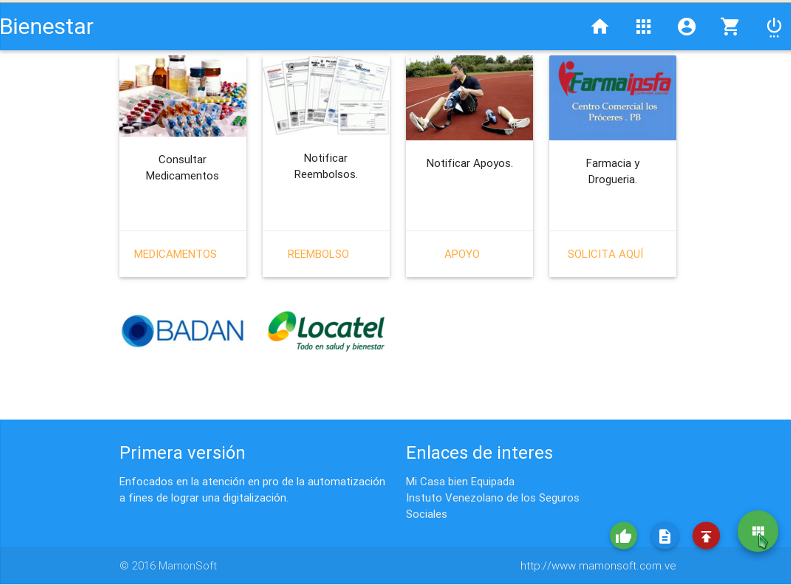
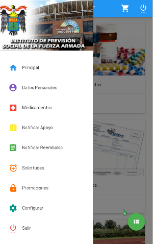

Ipsfa - Bienestar y Seguridad Social!
=====================================

Basado en los actuales procesos que buscan la automatización de los modelos de negocio en las diferentes direcciones 
que son competencia del Instituto de Previsión Social de la Fuerza Armada y la falta de presencia de herramientas 
conocidas mejor como orquestadores en algunas de las tareas.

Es primordial el diseño de una plataforma para el control, seguimiento y distribución de solicitudes en el área de ayudas y/o 
colaboración en medicamentos a corto, mediano y largo plazo. Así como dar el enfoque o brindar una herramienta para la 
digitalización del área de droguería y farmacia que buscarán brindar una plataforma de servicios en línea a fines claros 
de automatizar y agilizar los procesos de control para los insumos pendientes por repartir.

## Requerimientos
  - S.O Linux Recomendado Debián
  - PHP 5 o superior
  - Postgres 9.3 o Superior
  - ArgoUml.
  - WoPeD.
  - BD externa (UML) fuente: /public/uml/saman.zargo

## Instalación
  - BD Saman 
  - BD ipsfa-bss /system/sql/ipsfa
  - Modificar /application/config/config.php
  - Modificar /application/config/database.php

## Arquitectura
  - CodeIgniter V.3 (Base)
  - Lenguajes:
    - Html 5   
    - Materialize Css
    - JavaScript Jquery 3
    - Css 3
    - PHP 5
    - NoSQL Objetos (Json)
    - (UML) fuente: /public/uml/ipsfa.zargo
### Diargrama IPSFA UML

### Diagrama SAMAN UML

## Prototipo

